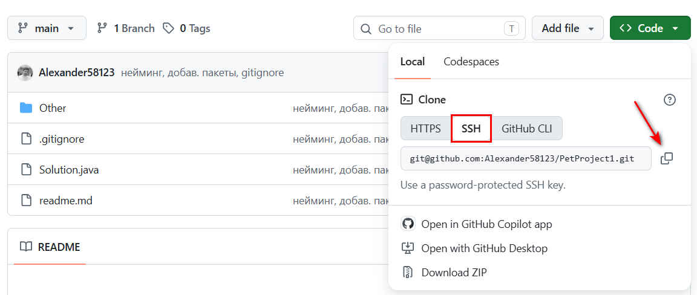
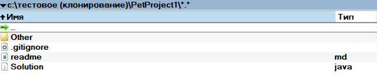

# Базовый flow работы с проектом (GIT)

> Инструкция направлена на этап онбординга с проектом. Полезна для разработчиков, тестировщиков и др. членов команды.

## Клонирование проекта из git-репозитория

> [!WARNING] Перед началом клонирования
> GIT должен быть установлен и настроен на локальной машине.

1. Запросите у команды разработки / руководителя ссылку на репозиторий, которая находится на (github, gitlab) следующего вида https://github.com/Alexander58123/PetProject1
2. Переходим по полученной ссылке
   - Нажимаем кнопку , откроется выпадающее окно;
   - Во вкладках выбираем соответствующий протокол HTTP, SSH (если это SSH, то он должен быть заранее настроен локально) и копируем ссылку в буфер обмена
   
3. В Проводнике переходите в каталог (папку), куда вы ходите клонировать проект, вызываете контекстное меню ПК мыши:
   - Выбираете пункт "Open Git Bash here"
   
   - Вводите команду клонирования репозитория + раннее скопированная ссылка. 
   Полная команда будет след. вида: `git clone git@github.com:Alexander58123/PetProject1.git`  
   Выполните команду, нажав "Enter". На скриншоте видно успешный процесс клонирования.
   
   - В каталоге (папке) появится склонированный репозиторий
   