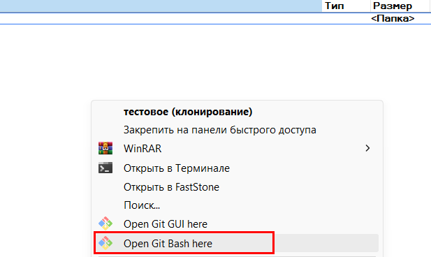
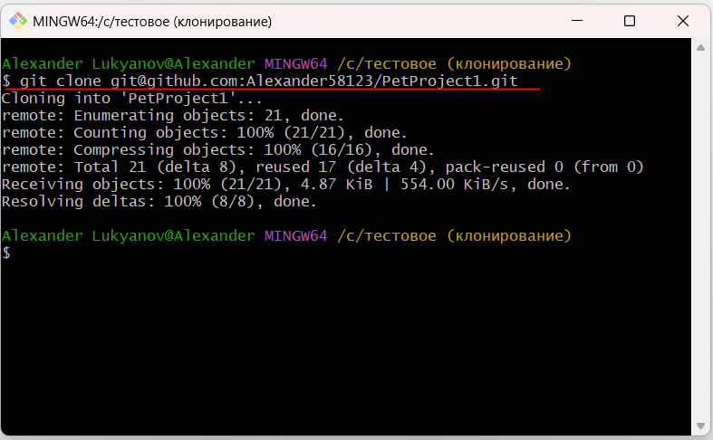
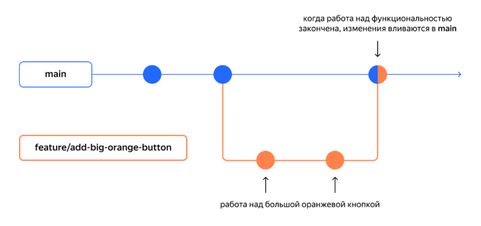
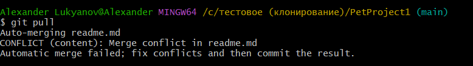
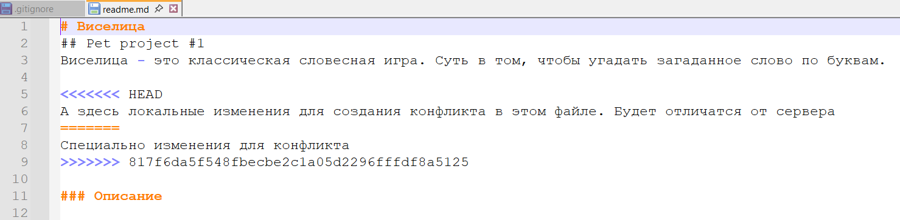

# Базовый flow работы с проектом (GIT)

> Инструкция направлена на этап онбординга с проектом. Полезна для разработчиков, тестировщиков и др. членов команды.

## Клонирование проекта из git-репозитория

> ⚠️ Перед началом клонирования
> GIT должен быть установлен и настроен на локальной машине.

1. Запросите у команды разработки / руководителя ссылку на репозиторий, которая находится на (github, gitlab) следующего вида https://github.com/Alexander58123/PetProject1
2. Переходим по полученной ссылке
   - Нажимаем кнопку , откроется выпадающее окно;
   - Во вкладках выбираем соответствующий протокол HTTP, SSH (если это SSH, то он должен быть заранее настроен локально) и копируем ссылку в буфер обмена
   
3. В Проводнике переходите в каталог (папку), куда вы ходите клонировать проект, вызываете контекстное меню ПК мыши:
   - Выбираете пункт "Open Git Bash here"  
   
   - Вводите команду клонирования репозитория + раннее скопированная ссылка. 
   Полная команда будет след. вида: `git clone git@github.com:Alexander58123/PetProject1.git`  
   Выполните команду, нажав "Enter". На скриншоте видно успешный процесс клонирования.
   
   - В каталоге (папке) появится склонированный репозиторий
   

## Ответвление и создание ветки для (фичи, бага)

В Организации Х принята работа по стандартному flow и работе с ветками. См. пример


> ⚠️Перед каждой фичей, багфиксом и прочими добработками, обязательно создаем новую ветку и делаем локальные изменения в своей ветке.

### Команды для работы в новой ветке

**Подтянуть свежие изменения**  
Обязательно подтягивайте свежие изменения из репозитория, команды:
- `git fetch`
- `git pull`

**Создание ветки**  

1 вариант:  
- Используйте команду git branch, указав имя новой ветки:  
`git branch <имя_новой_ветки>`
- Затем переключитесь на нее  
`git checkout <имя_новой_ветки>`

2 вариант:
- Создайте ветку и сразу переключитесь на нее  
`git switch -c <имя_новой_ветки>`

## Разрешение конфликтов
**Рассмотрим ситуацию:**  
- Вы отредактировали локальную версию файла из проекта
- В это время на удаленном репозитории появляется новая версия этого файла
- Вам необходимо отправить в удаленный репозиторий ваши изменения

**Общий алгоритм и последовательность работы**  
Вам необходимо сначала "подтянуть" чужие изменения, объединить их со своими (если потребутся, разрешив конфликт), и только потом отправить результат на сервер.

### 1. Фиксация локальных изменений
Перед тем как "подтягивать" чужие изменения, нужно сохранить локальные правки.

- добаляем измененный файл в индекс  
`git add ваш файл.html`
- создаем коммит с изменениями  
`git commit -m "Описание вкратце какие были изменений в файле"`

### 2. Синхронизация с удаленным репозиторием
Получаем новую версию файла с сервера и объединяем ее с вашим коммитом.

- выполняем команду "подтягивания" изменений  
`git pull origin <имя_вашей_ветки>`  
_Например: git pull origin main или git pull origin master_

### 3. Разрешение конфликта при слиянии
Так как вы изменили один и тот же файл, что и другой разработчик на сервере. Высокая вероятностью 99% Git не сможет автоматически объединить изменения и выдаст конфликт слияния.

- Если Git написал `Auto-merging...` и сразу создал коммит — тогда можете сразу отправить измененения на сервер  
  `git push origin <имя_вашей_ветки>`
- Если сообщение вида `CONFLICT (content): Merge conflict in...` — выполните пункты ниже по решению конфликта.

---

- **Откройте файл, где произошел конфликт в VS Code, IntelliJ IDEA**  
  Git самостоятельно добавляет в текст специальные маркеры, показывающие, где именно возник конфликт:
   ```
     <<<<<<< HEAD
   Ваш локальный текст (то, что написали вы)
   =======
   Удаленный текст (то, что пришло с сервера)
   >>>>>>> branch-name
  ```
  Пример конфликта в файле:
    


- **Вручную отредактируйте файл**  
  - Вам нужно решить, какой код должен остаться в итоге:
    - Оставьте только свой вариант.
    - Оставьте только удаленный вариант.
    - Объедините оба варианта так, чтобы они работали вместе.
    - Обязательно удалите все строки с маркерами (<<<<<<<, =======, >>>>>>>).
    - Сохраните файл. 


- Добавляем измененный файл в индекс командой  
`git add ваш файл.html`


- Создаем merge-коммит  
`git commit -m "Описание **** разрешен конфликт в файле"`


- Отпраляем изменения на сервер  
`git push origin <имя_вашей_ветки>`